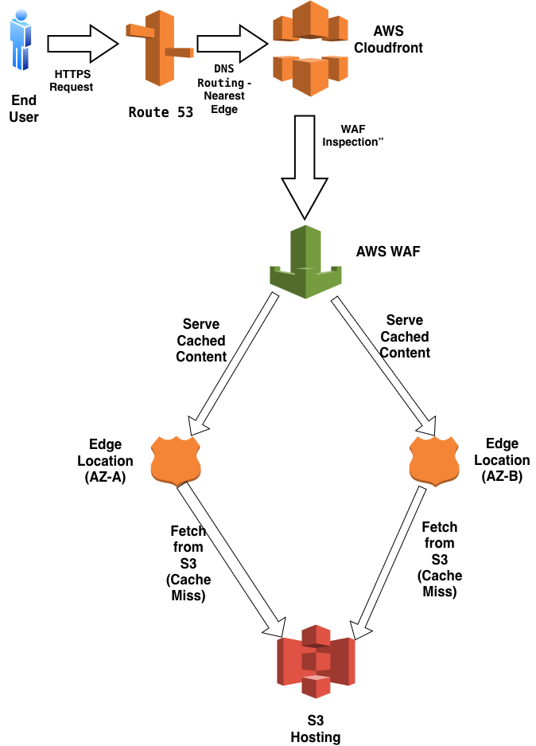
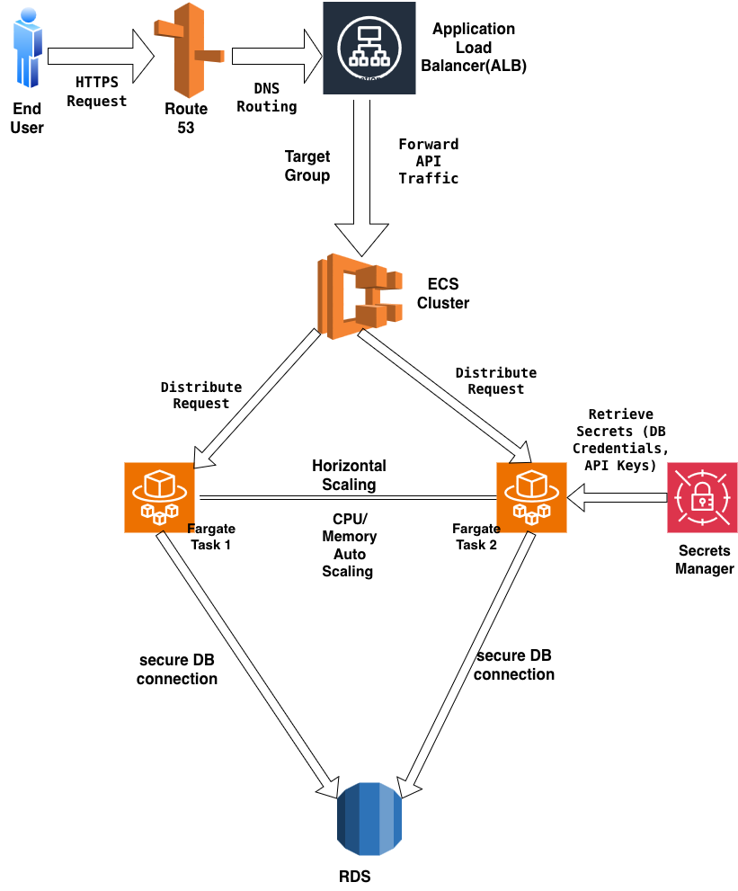
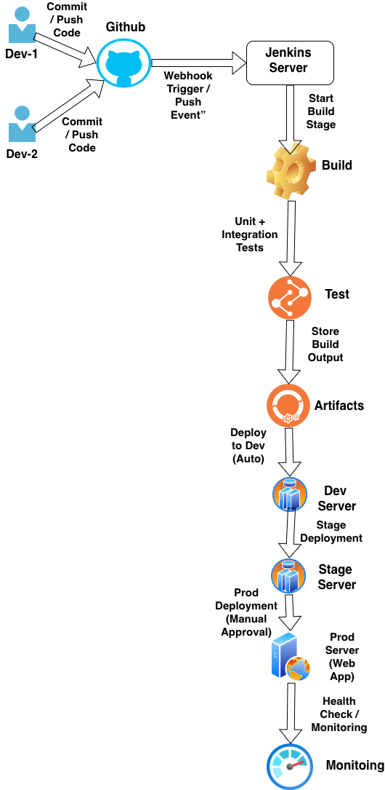

# AWS Architecture Design 

## 1. UI (Frontend) Architecture Design Overview
This document describes a frontend (UI) architecture hosted on AWS designed for high performance, security, and availability.  
The design uses a serverless CDN-backed approach (CloudFront + S3) with AWS WAF for protection.

---

## Architecture Diagram

**Embedded diagram (PNG):**  

**Downloadable diagram (PDF):**  
[ui-arch.pdf](./ui-arch.pdf)

> Diagram flow (high level):  
> End User → Route 53 → CloudFront → WAF → CloudFront Edge Locations (AZ-A / AZ-B) → S3 (origin)

---

## Components

### 1. End User
Client (browser or mobile app webview) requesting the UI over HTTPS.

### 2. Route 53
DNS service that resolves the website domain and points the user to the CloudFront distribution. Route 53 returns the nearest edge based on routing policies/latency.

### 3. Amazon CloudFront
Global Content Delivery Network (CDN) that:
- Terminates TLS for client requests,
- Caches static assets (HTML, JS, CSS, images),
- Auto-scales across its global edge network to handle traffic spikes,
- Forwards non-cached requests to the origin (S3).

### 4. AWS WAF
Web Application Firewall attached to the CloudFront distribution to:
- Filter and block malicious or suspicious requests,
- Enforce custom rules (rate limits, IP blocks, geo block, SQLi/XSS protections),
- Reduce unwanted traffic before it reaches origin.

### 5. CloudFront Edge Locations (AZ-A, AZ-B)
Edge POPs located in multiple Availability Zones and regions. They serve cached content closest to users (lowers latency) and provide fault tolerance through distribution.

### 6. Amazon S3 (Static Website Hosting)
S3 bucket configured as the origin for CloudFront. Stores built frontend artifacts (React/Angular/Vue production build). Highly durable, highly available, and automatically scales to handle origin requests.

---

## How the UI is Hosted
Primary hosting approach:
- **S3 + CloudFront** (recommended for modern SPAs)
  - S3 stores the static build artifacts.
  - CloudFront distributes and caches content globally.
  - Route 53 provides DNS (alias to CloudFront distribution).
  - AWS WAF is attached to CloudFront for security.

Alternate hosting approaches (not used here but valid depending on requirements):
- **ALB + ECS / EC2** (if server-side rendering or dynamic backend is needed)
- **Amplify** (for quick CI/CD for static apps)

---

## Scaling Approach for UI

**Horizontal scaling**
- **CloudFront (CDN)**: automatically scales horizontally across many edge locations. It can absorb large bursts of traffic without provisioning servers.
- **S3 (origin)**: storage and bandwidth scale virtually without user-managed instances.
- No application servers → eliminates the need for autoscaling groups for the UI layer.

**Caching strategy**
- Set long `Cache-Control` for immutable assets (e.g., hashed JS/CSS).
- Set reasonable TTLs for HTML (or use Cache-Control + stale-while-revalidate if using SSR).
- Use CloudFront behaviors to segregate cache rules per path.

**Traffic routing & availability**
- Route 53 routes users to the nearest edge location (latency-based).
- CloudFront edge locations exist across multiple AZs/regions to ensure availability.
- S3 cross-region replication (optional) can add redundancy for origin bucket.

---

## How the System Handles Load

1. **DNS resolution**  
   - User resolves the domain via Route 53 and is directed to the nearest CloudFront edge.

2. **Edge serve (cache hit) — the fast path**  
   - CloudFront serves the requested static asset directly from the edge POP cache.
   - Most requests (90%+) should be cache hits — minimal latency and no origin load.

3. **Edge miss (cache miss) — origin fetch**  
   - CloudFront forwards the request to the origin (S3).
   - S3 serves the file; CloudFront caches it for subsequent requests.

4. **Security & filtering**
   - AWS WAF inspects requests (attached to CloudFront). Malicious or anomalous requests are blocked at the CDN layer, preventing origin overload.

5. **Autoscaling and resilience**
   - CloudFront’s global design automatically scales to handle millions of requests per second.
   - S3 remains highly available and durable; rarely becomes a bottleneck due to caching.
   - Multi-AZ edge distribution ensures regional or AZ failures have minimal user impact.

6. **Monitoring & alarms (recommended)**
   - **CloudWatch** for metrics (requests, error rates, cache hit ratio).
   - **CloudFront logs** + **S3 logs** for access analytics.
   - **AWS Config / GuardDuty** for security posture monitoring.

-----------------------------------------------------------------------------------------------------------------------------------------------------

## 2. API (Backend) Architecture Design Overview
This document describes a backend (API) architecture deployed on AWS designed for scalability, security, fault tolerance, and efficient request handling.  
The design uses **ECS Fargate** (serverless containers) behind an **Application Load Balancer (ALB)**, with automatic horizontal scaling and secure secret management using AWS Secrets Manager.

---

## Architecture Diagram

**Embedded diagram (PNG):**  

**Downloadable diagram (PDF):**  
[api-arch.pdf](./api-arch.pdf)

> Diagram flow (high level):  
> End User → Route 53 → ALB → ECS Cluster (Fargate Tasks) → Secrets Manager → RDS (secure DB connection)

---

## Components

### 1. End User
A client (mobile, frontend web app, or service) making HTTPS API requests.  
Requests are routed to the backend API domain using DNS.

---

### 2. Route 53
AWS Route 53 resolves the API domain and directs the request to the **Application Load Balancer (ALB)**.  
Routing options such as latency-based routing or health checks ensure users hit a healthy endpoint.

---

### 3. Application Load Balancer (ALB)
The ALB:
- Accepts **HTTPS** traffic (TLS termination),
- Performs health checks on ECS tasks,
- Routes requests to the target group associated with the ECS service,
- Ensures even distribution of traffic across all running API containers.

The ALB provides Layer 7 routing and can support path-based rules (e.g., `/auth`, `/users`, `/orders`).

---

### 4. ECS Cluster (Fargate)
The compute layer running your API containers.  
Key features:
- Fully managed, serverless container runtime (Fargate),
- No EC2 instances to manage,
- Each task runs an isolated container environment.

The ECS cluster receives traffic from ALB and distributes requests across tasks.

---

### 5. Fargate Tasks (Task 1, Task 2, …)
Each task represents one instance of the API application container.

Responsibilities:
- Process API requests,
- Communicate with RDS,
- Retrieve API keys, DB credentials, and secrets from **Secrets Manager**,
- Remain stateless to support horizontal scaling,
- Scale up/down based on demand.

Multiple tasks ensure high availability and parallel workload processing.

---

### 6. Secrets Manager
A secure storage for:
- Database credentials,
- API keys,
- Connection strings,
- Sensitive configuration.

Fargate tasks dynamically fetch secrets at runtime — no hardcoded credentials.

---

### 7. Amazon RDS
The relational database storing application data.  
Provides:
- Multi-AZ availability,
- Automated backups,
- Secure connections (TLS),
- IAM authentication (optional).

Connections to RDS occur from private subnets to ensure no public exposure.

---

## How the API is Hosted
Primary hosting architecture:
- **ALB → ECS Fargate → RDS**
- Stateless API containers enable efficient horizontal scaling.
- Secrets Manager ensures secure storage of sensitive values.
- Route 53 handles DNS for the API domain.

Alternative approaches (not used here):
- EC2 Auto Scaling Groups
- Lambda + API Gateway (serverless)
- EKS (Kubernetes)

---

## Scaling Approach for API

### Horizontal Scaling
ECS Fargate scales based on CloudWatch metrics:
- **CPU Utilization**
- **Memory Utilization**
- **Request count per target**
- **ALB target response time**

When traffic increases:
- New Fargate tasks are launched automatically.
When traffic decreases:
- Tasks are terminated to reduce cost.

### Load Distribution
- ALB distributes incoming requests evenly across all healthy tasks.
- If a task becomes unhealthy, ALB routes traffic away automatically.

### Stateless Architecture
- Every task is identical and interchangeable.
- No session storage inside containers; use Redis or JWT tokens if needed.

---

## How the System Handles Load

### 1. DNS Resolution
Route 53 resolves the API domain and directs the client to the ALB.

### 2. Load Balancing
ALB terminates TLS and routes traffic across multiple Fargate tasks.

### 3. Automatic Scaling
ECS auto-scaling policies add tasks when:
- CPU spikes,
- Memory usage increases,
- Latency grows,
- Request load surges.

### 4. Secure Secret Retrieval
Fargate tasks fetch credentials dynamically from Secrets Manager, removing secret sprawl and reducing breach impact.

### 5. Database Connectivity
Each task establishes a secure (TLS) connection to RDS.  
Connection pooling strategies prevent DB overload.

### 6. Fault Tolerance
- Tasks run in multiple Availability Zones,
- ALB health checks ensure traffic flows to healthy tasks,
- Fargate tasks automatically restart on failure.

### 7. Monitoring & Logging
Recommended tools:
- **CloudWatch Logs** & Metrics,
- **X-Ray** for tracing,
- **ECS Service Events** for task health,
- **RDS Performance Insights**.

----------------------------------------------------------------------------------------------------------------------------------------------------

## 3. CI/CD Pipeline Design Overview
This document describes a **simple CI/CD workflow** implemented using **Jenkins** integrated with **GitHub Webhooks**.  
The pipeline provides automated stages for building, testing, storing artifacts, deploying, and verifying application health across environments.

---

## CI/CD Pipeline Diagram

**Embedded diagram (PNG):**  

**Downloadable diagram (PDF):**  
[cicd-pipeline.pdf](./ci-cd-1.pdf)

> **Pipeline Flow (High-Level):**  
> Developer Commit → GitHub Webhook → Jenkins → Build → Test → Artifacts → Deploy to Dev → Deploy to Stage → Manual Approval → Deploy to Prod → Monitoring & Health Checks

---

## Components

### 1. Developers
Developers (Dev-1, Dev-2) write code and push changes to the GitHub repository.  
These pushes create new versions of the application.

---

### 2. GitHub Repository
- Stores the codebase  
- Acts as the pipeline trigger source  
- Webhook notifies Jenkins whenever:
  - Code is pushed  
  - Pull request is merged  
  - Branch updates occur  

---

### 3. Jenkins Server
Jenkins orchestrates the entire CI/CD workflow.

Responsibilities:
- Receives GitHub webhook events  
- Starts the pipeline automatically  
- Runs build, test, and deployment stages  
- Handles approvals, artifact storage, and notifications  

---

### 4. Build Stage
The build stage is triggered after webhook notification.

This stage:
- Pulls the latest code  
- Installs dependencies  
- Compiles the application  
- Prepares artifacts for testing  

---

### 5. Test Stage
Automated **Unit Tests** and **Integration Tests** are executed.

Benefits:
- Ensures build quality  
- Detects issues early  
- Prevents broken code from reaching deployment environments  

Only if tests pass, the pipeline proceeds.

---

### 6. Artifacts Stage
Jenkins stores the build output (artifacts) for deployment.

Artifacts may include:
- Compiled binaries  
- Packaged application bundles  
- Static files  
- Container images (if extended)

Stored artifacts are versioned for traceability and rollback.

---

### 7. Deployment Stages

#### **Dev Environment (Auto Deploy)**
- Every successful build & test is automatically deployed to Dev  
- Allows quick developer validation  
- Ensures rapid iteration

#### **Stage Environment**
- Artifact is promoted from Dev → Stage  
- Automatically deployed  
- Used for integration, QA, and UAT testing  

#### **Prod Environment (Manual Approval)**
- Requires an explicit approval step  
- Ensures controlled releases  
- Reduces production risks  
- Once approved, Jenkins deploys to the production environment

---

### 8. Monitoring & Health Checks
After production deployment:
- Jenkins performs a basic health check (e.g., `/health` endpoint)  
- Application monitoring tools validate uptime and performance  
- If health checks fail, rollback or notifications can be triggered  

---

## Promotion Strategy
The pipeline follows a clear controlled path:

**Dev → Stage → Prod**

- Dev: Fast feedback, automatic deployments  
- Stage: Stable testing environment  
- Prod: Manual approval ensures safety  

This ensures reliable and predictable releases.
---

The overall goal is to ensure:
- Automated and reliable code delivery  
- Consistent testing before deployments  
- Controlled promotion from Dev → Stage → Prod  
- Safer production releases using manual approval gates  

---
